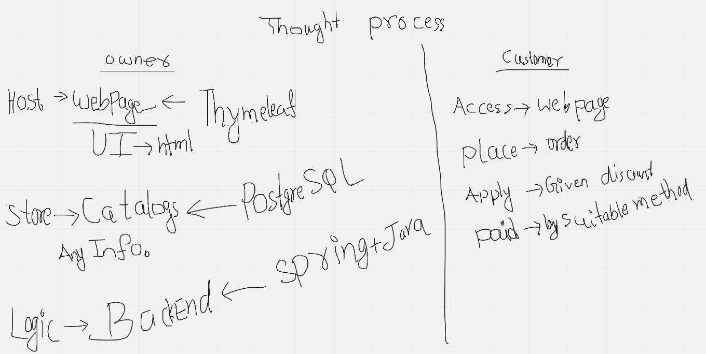

# raj-traders-application

This real world project to know complete steps to develop fullstack applications for orders and sales related
business. In order to develop this project we will use variety of technologies that are required.

## Business Requirements

* Actors: `owner` and `customer`

* As an owner, I want to show items to the customer with their item price.
* As an owner, I want to show more options for specific customer quotation.
* As an owner, I want to apply custom discount on sale total amount if customer bargain.
* As an owner, I want to provide payment method such as online payment, in cash, or in installment.
* As an owner, I want to create package for once consumer verified payment.
* As an owner, If customer claim for warranty for defect item I want to replace and report to vendor.
* As an owner, If customer request for repair for a defect item I want to repair it.

* As a customer, I want to search for item to see the rate.
* As a customer, I want to see various option and choose best option.
* As a customer, I want to search for discount options.
* As a customer, I want to complete order with suitable payment method.
* As a customer, I want to add warranty record for purchased item.
* As a customer, I want to mark some purchase as gift options.

## Thought Process

